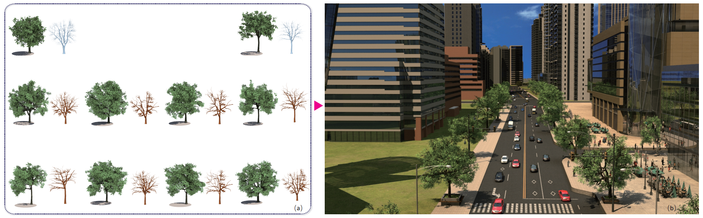

Yutong Wang is now a Ph.D candidate in the State Key Lab of CAD & CG, Zhejiang University under the supervision of Professor Xiaogang Jin. Her research interest is computer graphics, especially in <b>creative tree modeling</b>, <b>computer animation</b> and <b>sketch-based interactive modeling</b>. Before that, she received her B.S. degree in Software Engineering from Chongqing University in 2012.

<h2>Education</h2>
<ul>
	<li>Ph.D Zhejiang University from Sep. 2012- Now</li>
	<li>B.Sc. Chongqing University from Sep. 2008- Jun. 2012</li>
</ul>

<h2>Skills</h2>

<ul class="skill-list">
	<li>C++</li>
	<li>Qt</li>
	<li>Latex</li>
</ul>

<h2>Publications</h2>

<ul>
	<li>
	 

        
<h3>Creative Virtual Tree Modeling through Hierarchical Topology-preserving Blending</h3>
		<B><I>Yutong Wang</I></B>, Xiaowei Xue, Xiaogang Jin, Zhigang Deng. <i>IEEE Transactions on Visualization and Computer Graphics</i>, IEEE Computer Society, 2016 (accepted)

			 
	 
  
	</li>
	
  <li>
      

         
<h3>Topologically Consistent Leafy Tree Morphing</h3>
		 <B><I>Yutong Wang</I></B>, Luyuan Wang, Zhigang Deng and Xiaogang Jin. <i>Computer Animation and Virtual Worlds</i> Wiley, 2017, 29 (Accepted). (Best Paper Award for CASA'2017)
	 
         
      
    
    </li>
	
	<li>
		

        
<h3>Sketch-Based Interactive Modeling of Geology</h3>
		<B><I>Yutong Wang</I></B>, Hao Chen, Tanghao Tian, Xiaogang Jin. <i>IJournal of Software</i>, ,2016,27(Suppl.(2)):207−219 (in Chinese) 

			 
	 
 
	</li>
	
</ul>
